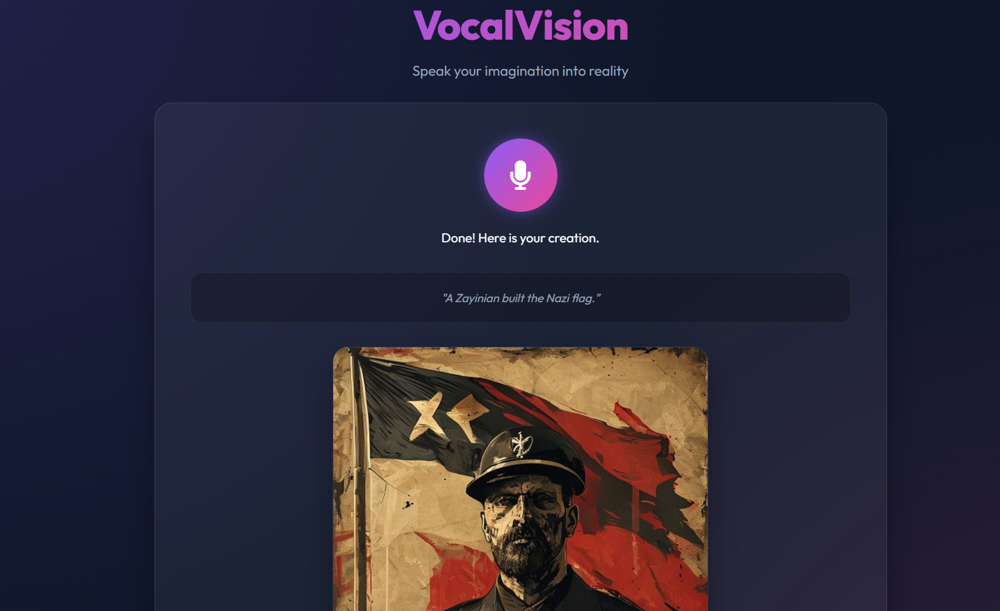

# 🎙️ VocalVision — Speak Your Imagination Into Reality

<p align="center">
  <b>VocalVision</b> is a full-stack AI application that turns your voice into stunning AI-generated images.<br/>
  Speak in <b>any language</b> — VocalVision transcribes, translates, and visualizes your words instantly.
</p>

<p align="center">
  
  
  
  
  
</p>

---

## ✨ Features

- 🎤 **Voice Recording** — Record audio directly in the browser (no plugins needed)
- 🌍 **Multilingual Support** — Transcribes 90+ languages via Whisper (powered by Groq)
- 🔄 **Auto Translation** — Detects non-English speech and translates it to English using LLaMA 3.1
- 🖼️ **AI Image Generation** — Generates images from your voice prompt via [Pollinations.ai](https://pollinations.ai) (free, no API key needed)
- ⚡ **Full Pipeline in One Click** — Single `/api/speech-to-image` endpoint handles everything end-to-end
- 💾 **Local Image Storage** — Generated images are saved locally and served from the backend, avoiding CORS issues

---

## 🖼️ Demo

> Speak a prompt like *"A futuristic city at sunset with flying cars"* and watch it come to life.

<p align="center">
  
</p>

---

## 🗂️ Project Structure

<p align="center">
  
</p>

```
speech-image/
├── backend/
│   ├── config/
│   │   ├── __init__.py
│   │   └── config.py               # App-wide config (URLs, image dimensions, etc.)
│   │
│   ├── models/
│   │   └── model.py                # Pydantic request/response models
│   │
│   ├── routes/
│   │   ├── __init__.py
│   │   ├── image_routes.py         # POST /api/generate-image
│   │   ├── orchestrator_routes.py  # POST /api/speech-to-image (full pipeline)
│   │   └── speech_routes.py        # POST /api/transcribe
│   │
│   ├── services/
│   │   ├── __init__.py
│   │   ├── stt_service.py          # Speech-to-text via Whisper (Groq)
│   │   ├── translate_service.py    # Language detection + translation via LLaMA 3.1
│   │   └── tti_service.py          # Text-to-image via Pollinations.ai
│   │
│   ├── outputs/                    # Auto-created: stores generated images
│   └── main.py                     # FastAPI app entry point
│
├── frontend/
│   ├── index.html                  # Main UI
│   ├── script.js                   # Recording logic & API calls
│   └── style.css                   # Styles
│
├── .env                            # Environment variables (see below)
├── .gitignore
└── requirements.txt
```

---

## ⚙️ How It Works

```
🎙️ User speaks
      │
      ▼
[ 1. STT ] — Groq Whisper API transcribes audio → raw transcript
      │
      ▼
[ 2. Translate ] — LLaMA 3.1 detects language → translates to English (if needed)
      │
      ▼
[ 3. TTI ] — Pollinations.ai generates image from English prompt
      │
      ▼
[ 4. Serve ] — Image saved locally → served at /outputs/<uuid>.png
```

---

## 🚀 Getting Started

### Prerequisites

- Python 3.10+
- A [Groq API key](https://console.groq.com/) (free tier available)

### 1. Clone the Repository

```bash
git clone https://github.com/Swara-art/VocalVision.git
cd VocalVision
```

### 2. Install Dependencies

```bash
pip install -r requirements.txt
```

### 3. Configure Environment Variables

Create a `.env` file in the project root:

```env
GROQ_API_KEY=your_groq_api_key_here
```

> ℹ️ The Groq API key is used for both Whisper (STT) and LLaMA 3.1 (translation).  
> Image generation via Pollinations.ai is **free** and requires no key.

### 4. Run the Backend

```bash
cd backend
uvicorn main:app --reload --port 8000
```

### 5. Open the App

Visit **[http://localhost:8000](http://localhost:8000)** in your browser.

---

## 📡 API Reference

### `POST /api/speech-to-image` *(Full Pipeline)*
Accepts an audio file and returns a transcription, detected language, translated prompt, and generated image URL.

| Field | Type | Description |
|---|---|---|
| `audio` | `file` | Audio file (webm, mp4, wav, mp3, ogg, flac) |

**Response:**
```json
{
  "image_url": "/outputs/<uuid>.png",
  "transcription": "original transcript in source language",
  "translated_prompt": "English prompt sent to image generator",
  "detected_language": "Hindi",
  "was_translated": true,
  "width": 1024,
  "height": 768
}
```

---

### `POST /api/transcribe`
Transcribes an audio file to text using Whisper.

---

### `POST /api/generate-image`
Generates an image from a text prompt via Pollinations.ai.

| Field | Type | Default | Description |
|---|---|---|---|
| `prompt` | `string` | — | Text prompt for image generation |
| `width` | `int` | `1024` | Image width in pixels |
| `height` | `int` | `768` | Image height in pixels |

---

## 🧰 Tech Stack

| Layer | Technology |
|---|---|
| **Backend** | [FastAPI](https://fastapi.tiangolo.com/) |
| **Speech-to-Text** | [Whisper large-v3](https://groq.com/) via Groq |
| **Translation** | [LLaMA 3.1 8B Instant](https://groq.com/) via Groq |
| **Image Generation** | [Pollinations.ai](https://pollinations.ai/) (free, no key) |
| **Frontend** | Vanilla HTML / CSS / JS |
| **HTTP Client** | [httpx](https://www.python-httpx.org/) |

---

## 🔒 Content Safety

The Pollinations.ai integration has `safe=true` enabled by default, which activates their built-in content safety filter. This filters out harmful or inappropriate image generations at the service level.

---

## 📌 Environment Variables

| Variable | Required | Description |
|---|---|---|
| `GROQ_API_KEY` | ✅ Yes | Used for Whisper STT + LLaMA translation |

---

## 🤝 Contributing

Pull requests are welcome! For major changes, please open an issue first to discuss what you'd like to change.

1. Fork the repository
2. Create your feature branch: `git checkout -b feature/amazing-feature`
3. Commit your changes: `git commit -m 'Add amazing feature'`
4. Push to the branch: `git push origin feature/amazing-feature`
5. Open a Pull Request

---

## 📄 License

This project is licensed under the **MIT License** — see the [LICENSE](LICENSE) file for details.

---

<p align="center">
  Built with ❤️ using FastAPI, Groq, and Pollinations.ai
</p>
